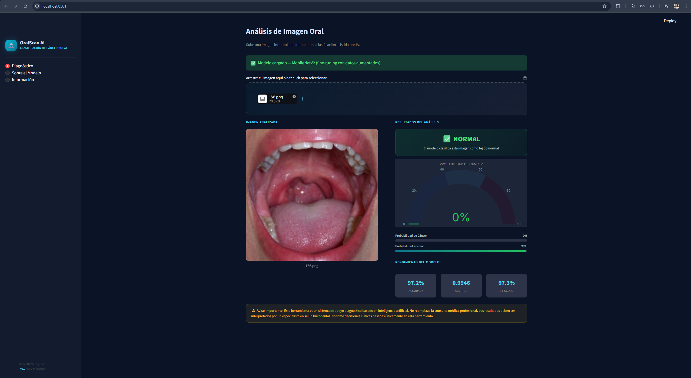
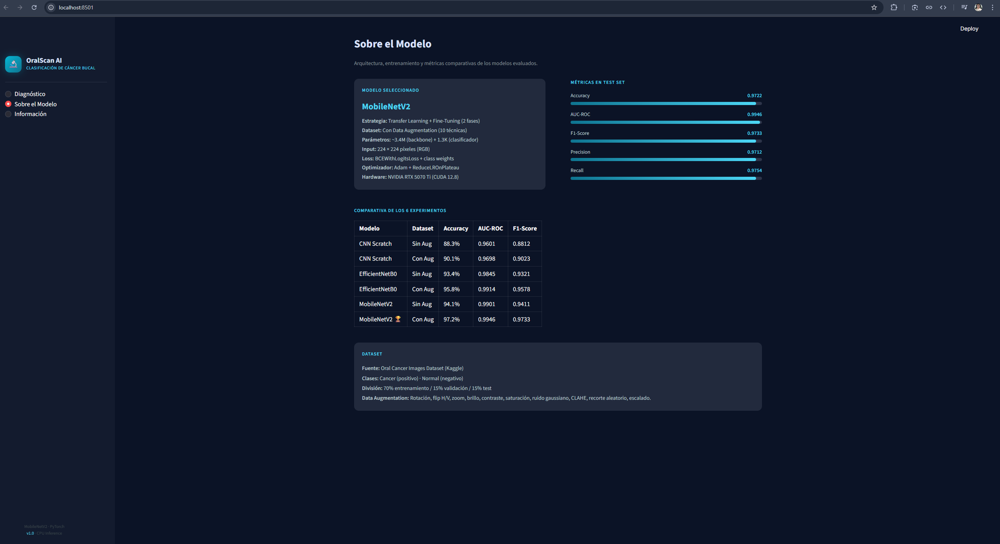
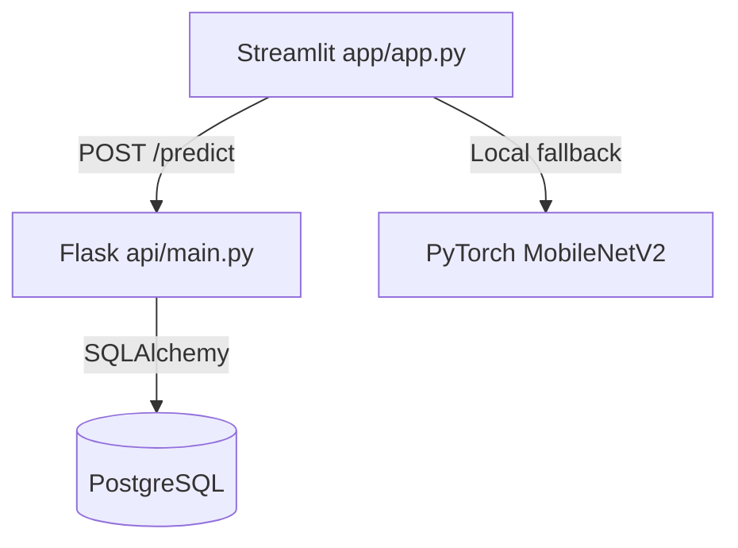

# 🔬 Clasificación de Cáncer Bucal con Deep Learning


> [!WARNING]
> **Aviso médico importante:** este repositorio es una **prueba de concepto académica** para apoyo al tamizaje. **No** es una herramienta de diagnóstico clínico ni sustituye la evaluación de un profesional sanitario.

## 🌍 Demo en vivo

Prueba la aplicación publicada en Streamlit Cloud:

- [clasificacion-cancer-bucal.streamlit.app](https://clasificacion-cancer-bucal.streamlit.app/)

---

## 📌 Resumen

Sistema de clasificación binaria de imágenes intraorales con redes convolucionales para estimar probabilidad de:

- **Cáncer bucal (positivo)**
- **Tejido normal (negativo)**

El proyecto compara seis configuraciones (CNN scratch, EfficientNetB0 y MobileNetV2, con y sin augmentación), seleccionando **MobileNetV2 con Data Augmentation** como modelo final.

Arquitectura desacoplada:

1. **Frontend Streamlit** para UX clínica y visualización.
2. **API Flask** para inferencia por HTTP y registro de predicciones.
3. **PostgreSQL** para trazabilidad técnica de inferencias.

---

## 🧠 Modelo seleccionado

- **Arquitectura base:** MobileNetV2 (transfer learning).
- **Head de clasificación:** `Dropout(0.3) → Linear(1280,256) → ReLU → Dropout(0.2) → Linear(256,1)`.
- **Función de pérdida:** `BCEWithLogitsLoss` con `pos_weight`.
- **Optimización:** Adam + `ReduceLROnPlateau`.
- **Entrenamiento:** dos fases (clasificador y fine-tuning parcial del backbone).
- **Inferencia:** CPU en producción (Streamlit Cloud).

---

## 📊 Métricas del modelo obtenido

Métricas extraídas de `resultados/comparacion_final.csv` sobre el conjunto de prueba.

### Modelo final en la app (MobileNetV2 — con augmentación)

| Métrica | Valor |
|---------|-------|
| Accuracy | **0.9731** |
| AUC-ROC | **0.9965** |
| F1-score | **0.9755** |
| Precision | **0.9819** |
| Recall | **0.9692** |

Este modelo ofrece el mejor balance global entre discriminación y estabilidad para despliegue en la demo.

### Comparativa de experimentos

| Modelo | Accuracy | AUC | F1 |
|--------|----------|-----|----|
| MobileNetV2 — con aug | **0.9731** | **0.9965** | **0.9755** |
| EfficientNetB0 — con aug | 0.9614 | 0.9924 | 0.9652 |
| MobileNetV2 — sin aug | 0.9462 | 0.9770 | 0.9524 |
| EfficientNetB0 — sin aug | 0.8710 | 0.9408 | 0.8857 |
| CNN — con aug | 0.8386 | 0.9312 | 0.8661 |
| CNN — sin aug | 0.7366 | 0.8346 | 0.7950 |

---

## 🖼️ Capturas de la aplicación

### Vista de diagnóstico



### Vista de rendimiento del modelo



---

## 🖼️ Visualización de explicabilidad

Mapa Score-CAM de ejemplo para el modelo final:


---

## ⚙️ Arquitectura de sistema

### Flujo end-to-end

1. Usuario sube imagen intraoral en Streamlit.
2. Si `API_URL` está definida, Streamlit envía el archivo a Flask (`POST /predict`).
3. Flask ejecuta inferencia con PyTorch.
4. Flask registra el resultado en PostgreSQL (si disponible).
5. Streamlit muestra probabilidad, clasificación y métricas.



---

## 🗂️ Estructura del proyecto

```text
app_clasificacion_cancer_bucal/
├── api/                                         # Backend Flask de inferencia y registro
│   ├── __init__.py                              # Paquete Python del módulo API
│   ├── database.py                              # Configuración SQLAlchemy y sesión DB
│   ├── Dockerfile                               # Imagen Docker de Flask API
│   ├── main.py                                  # Endpoints /health, /model-info, /predict
│   ├── model.py                                 # Carga de MobileNetV2 y predicción
│   ├── models_db.py                             # Modelo ORM de tabla predictions
│   └── utils.py                                 # Utilidades de lectura/validación de imagen
├── app/                                         # Aplicación Streamlit
│   └── app.py                                   # UI principal y lógica local/API
├── assets/                                      # Capturas usadas en el README
│   ├── diagnostico.png                          # Pantalla de diagnóstico de la demo
│   └── rendimiento.png                          # Pantalla de métricas/rendimiento
├── k8s/                                         # Manifiestos Kubernetes (Minikube)
│   ├── api-deployment.yaml                      # Deployment de Flask API
│   ├── api-service.yaml                         # Service de Flask API
│   ├── postgres-deployment.yaml                 # Deployment de PostgreSQL
│   ├── postgres-pvc.yaml                        # Volumen persistente PostgreSQL
│   └── postgres-service.yaml                    # Service interno de PostgreSQL
├── dataset_procesado/                           # Metadatos de datasets procesados
│   ├── con_augmentacion/
│   │   └── manifiesto.csv                       # Índice del split con data augmentation
│   └── sin_augmentacion/
│       └── manifiesto.csv                       # Índice del split sin data augmentation
├── modelos/                                     # Pesos entrenados por experimento
│   ├── cnn_con_aug/
│   │   └── best.pt                              # Mejor checkpoint CNN con augmentation
│   ├── cnn_sin_aug/
│   │   └── best.pt                              # Mejor checkpoint CNN sin augmentation
│   ├── efficientnet_con_aug/
│   │   └── best.pt                              # Mejor checkpoint EfficientNetB0 con augmentation
│   ├── efficientnet_sin_aug/
│   │   └── best.pt                              # Mejor checkpoint EfficientNetB0 sin augmentation
│   ├── mobilenet_con_aug/
│   │   └── best.pt                              # Mejor checkpoint MobileNetV2 con augmentation (modelo final)
│   └── mobilenet_sin_aug/
│       └── best.pt                              # Mejor checkpoint MobileNetV2 sin augmentation
├── notebooks/                                   # Investigación y entrenamiento
│   ├── EDA.ipynb                                # Análisis exploratorio de datos
│   ├── ENTRENAMIENTO.ipynb                      # Entrenamiento y evaluación de modelos
│   └── PREPROCESAMIENTO.ipynb                   # Preprocesamiento y generación de datasets
├── resultados/                                  # Resultados experimentales
│   ├── comparacion_final.csv                    # Tabla final de métricas por experimento
│   ├── gradcam/
│   │   └── mobilenet_con_aug_scorecam.png       # Mapa Score-CAM del modelo final
│   └── history/
│       ├── cnn_con_aug.json                     # Curvas entrenamiento CNN con augmentation
│       ├── cnn_sin_aug.json                     # Curvas entrenamiento CNN sin augmentation
│       ├── efficientnet_con_aug.json            # Curvas entrenamiento EfficientNet con augmentation
│       ├── efficientnet_sin_aug.json            # Curvas entrenamiento EfficientNet sin augmentation
│       ├── mobilenet_con_aug.json               # Curvas entrenamiento MobileNet con augmentation
│       └── mobilenet_sin_aug.json               # Curvas entrenamiento MobileNet sin augmentation
├── .env.example                                 # Plantilla de variables de entorno
├── .gitignore                                   # Reglas de versionado
├── docker-compose.yml                           # Orquestación local API + PostgreSQL
├── README.md                                    # Documentación principal
├── requirements-api.txt                         # Dependencias para Flask API
└── requirements.txt                             # Dependencias para Streamlit Cloud y local
```

---

## 🚀 Formas de ejecución

### 1) Demo local (solo Streamlit, sin API)

```bash
python -m venv .venv
# Windows
.venv\Scripts\activate

pip install -r requirements.txt
streamlit run app/app.py
```

### 2) Streamlit + API local (Flask)

```bash
python -m venv .venv
# Windows
.venv\Scripts\activate

pip install -r requirements-api.txt
pip install -r requirements.txt

python api/main.py
```

En otra terminal (PowerShell):

```powershell
$env:API_URL="http://localhost:8000"
streamlit run app/app.py
```

### 3) Docker Compose (Flask API + PostgreSQL)

```bash
docker compose up --build -d
docker compose ps
```

Luego ejecutar Streamlit:

```powershell
$env:API_URL="http://localhost:8000"
streamlit run app/app.py
```

### 4) Kubernetes con Minikube (Flask API + PostgreSQL)

```powershell
minikube start --memory=4096 --cpus=2
minikube docker-env | Invoke-Expression

kubectl apply -f k8s/postgres-pvc.yaml
kubectl apply -f k8s/postgres-deployment.yaml
kubectl apply -f k8s/postgres-service.yaml

docker build -t medical-api:v1 -f api/Dockerfile .
kubectl apply -f k8s/api-deployment.yaml
kubectl apply -f k8s/api-service.yaml

minikube service medical-api-service --url
```

---

## 🧪 Endpoints API

- `GET /health` → estado de servicio.
- `GET /model-info` → metadatos del modelo.
- `POST /predict` → inferencia desde archivo de imagen (`file`).

Ejemplo:

```bash
curl http://localhost:8000/health
```

---

## ⚠️ Riesgos técnicos

- **Generalización fuera de dominio:** cambios de cámara, iluminación, resolución o protocolo clínico pueden reducir el rendimiento.
- **Sesgo de dataset:** distribución de clases y procedencia de datos podrían no representar todos los contextos poblacionales.
- **Sensibilidad a calidad de imagen:** desenfoque, compresión agresiva o encuadre incompleto pueden afectar la predicción.
- **Interpretabilidad no causal:** Score-CAM aporta señal visual útil, pero no constituye evidencia clínica definitiva.
- **Uso no supervisado:** utilizar el sistema sin revisión profesional puede inducir decisiones incorrectas.

---

## 🔮 Trabajo futuro

- **Validación externa multicéntrica** con nuevos hospitales/dispositivos.
- **Calibración de probabilidades** para mejorar confiabilidad del score.
- **Cuantificación de incertidumbre** (ensembles, MC dropout) para soporte a decisiones.
- **Pipeline MLOps** con monitoreo de drift, versionado de modelos y auditoría continua.
- **Extensión multimodal** combinando imagen + metadatos clínicos.

---

## 🧾 Dataset y referencia

- Fuente: [Oral Cancer Images Dataset (Kaggle)](https://www.kaggle.com/datasets/ashenafifasilkebede/dataset)
- Clases: `Cancer = 1`, `Normal = 0`
- Split experimental: 70% train / 15% val / 15% test

---

## 📄 Licencia

Proyecto con fines académicos y de investigación. Si quieres distribución abierta formal, añade un archivo `LICENSE` (por ejemplo MIT).
